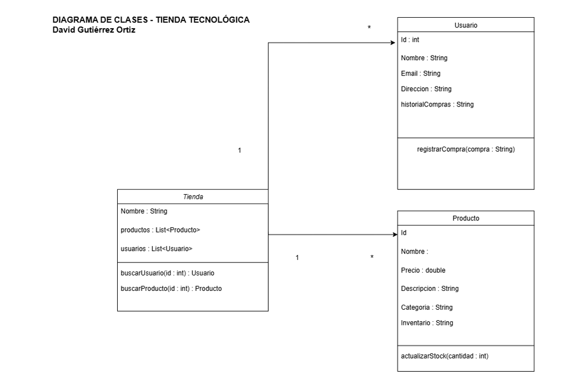

# 🏬 Tienda Tecnológica – Gutierrez David

Proyecto realizado para el módulo de **Acceso a Datos**, basado en el manejo de archivos **JSON** desde Java.  
El objetivo es simular una tienda tecnológica online donde se gestionan productos, usuarios y compras, con lectura y escritura de datos desde un archivo `JSON`.

---

## 📁 Estructura del proyecto

```plaintext
src/
└── main/
    ├── java/
    │   ├── com.david.app/
    │   │   ├── Main.java
    │   │   └── MenuTienda.java
    │   ├── io/
    │   │   ├── LectorJSON.java
    │   │   ├── LectorJSON_V2.java
    │   │   └── EscritorJSON.java
    │   └── model/
    │       ├── Tienda.java
    │       ├── Usuario.java
    │       └── Producto.java
    └── resources/
        └── tienda.json

```

## ⚙️ Funcionalidades principales

- **Lectura de JSON** con `LectorJSON_V2` → genera los objetos `Tienda`, `Usuario` y `Producto`.
- **Menú interactivo** (`MenuTienda`) para:
  - Ver usuarios y productos.
  - Seleccionar usuario activo.
  - Realizar compras.
  - Guardar automáticamente los cambios en el JSON.
- **Escritura de JSON** con `EscritorJSON` → actualiza el archivo tras cada compra.

---

## 🧩 Clases principales

| Clase | Descripción |
|-------|--------------|
| `Tienda` | Contiene los productos y usuarios de la tienda. |
| `Usuario` | Representa un cliente con historial de compras. |
| `Producto` | Define los artículos disponibles. |
| `LectorJSON_V2` | Lee el archivo JSON y crea los objetos Java. |
| `EscritorJSON` | Guarda los datos modificados en el JSON. |
| `MenuTienda` | Muestra el menú y gestiona las interacciones. |
| `Main` | Carga la tienda y lanza el menú principal. |

---

## 📊 Diagramas de clases

### 🧱 Diagrama inicial (fase de diseño)
Representa la planificación previa del sistema, antes de programar.



### ⚙️ Diagrama final (ingeniería inversa)
Generado automáticamente con el plugin **SimpleUML** de IntelliJ.  
Refleja las clases reales y sus relaciones finales.


---

## 🔍 Comparativa breve

- El **diagrama inicial** muestra solo las clases esenciales (`Tienda`, `Usuario`, `Producto`) con una visión conceptual.
- El **diagrama final** incluye todas las clases implementadas, sus métodos reales y dependencias (como `MenuTienda`, `LectorJSON_V2`, `EscritorJSON` y `Main`).
- Ambos mantienen la misma estructura base, pero el final refleja la lógica completa de la aplicación.

---

## 🧾 Conclusión

El desarrollo del proyecto permitió aplicar el manejo de archivos **JSON** mediante **POO en Java**,  
integrando lectura, modificación y escritura de datos con una estructura modular.  
Los diagramas muestran la evolución desde el diseño inicial hasta la implementación final completa.

---

© 2025 – David Gutiérrez
